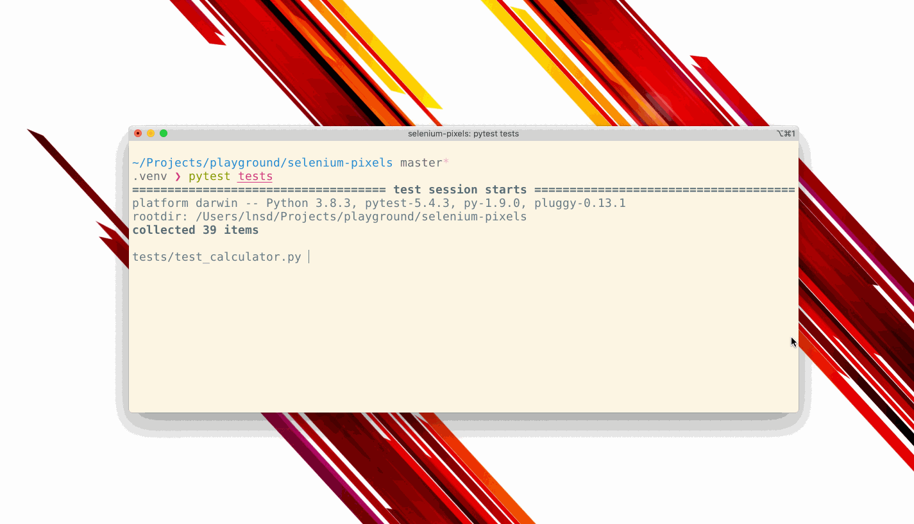

= Selenium-canvas-example
 Showcase project that uses Selenium to test an application embedded inside a
 `<canvas>` element.

The HTML5 `<canvas>` element is a black box from the selenium DOM point of
view. This means that in order to interact and get feedback from it we should
treat it bunch of pixels and process it using image processing techinques
to extract the information.

This automatic test cases are executed across different web browsers (Firefox,
Chrome and Safari).

== The example

This project has been developed using:

* Python 3.8
* Selenium
* OpenCV
* Tesseract OCR

It automates a series of test cases covering the functionality of a `<canvas>`
based calculator: https://www.pyimagesearch.com/2017/07/03/installing-tesseract-for-ocr/

== Prerequisites

* Python 3.8 (Python 3.4+ should work)
* Selenium browser drivers:
** Chrome: https://sites.google.com/a/chromium.org/chromedriver/downloads
** Firefox: https://github.com/mozilla/geckodriver/releases
** Safari: https://webkit.org/blog/6900/webdriver-support-in-safari-10/
* Tesseract OCR: https://www.pyimagesearch.com/2017/07/03/installing-tesseract-for-ocr/

== Running test cases

1. Create a virtual environment:

 $ python venv .venv

2. If virtual environment is not activated, activate it:

 $ source .venv/bin/activate

3. Install python dependencies:

 # Install using poetry
 .venv $ poetry install

 # Install using pip
 .venv $ pip install -r requirements.txt

4. Execute the tests!

 .venv $ pytest tests
